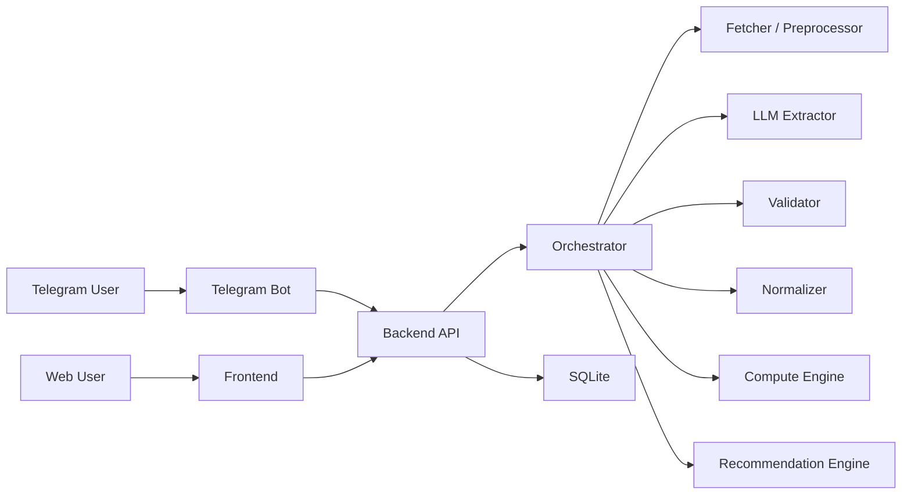

# HSE Study Agent: Project Context

## 1. Что мы делаем

Мы делаем AI-агента для студентов ФКН/ВШЭ, который собирает учебные данные из разрозненных источников, нормализует их, анализирует прогресс и дает персональные рекомендации.

Ключевая проблема:
- ведомости и учебная информация лежат в разных Google/Yandex таблицах и на разных сайтах;
- структура везде разная;
- формулы оценивания неочевидны;
- студенту трудно быстро понять, что происходит по всем предметам.

Ключевая идея:
- не делать "универсальный парсер всего";
- делать `agent-assisted extraction`: агент помогает понять структуру нестандартных таблиц и страниц, но итоговая система опирается на валидаторы, нормализацию и обычную Python-логику.

## 2. Продуктовое решение

У системы будет:
- `Frontend` для формы, дашборда и просмотра результатов;
- `Telegram-бот` как основной агентный интерфейс;
- `единый Backend API`, к которому обращаются и фронтенд, и бот.

Именно backend является "мозгом" системы:
- принимает источники данных;
- запускает пайплайн анализа;
- вызывает LLM и инструменты;
- валидирует результаты;
- считает оценки и рекомендации;
- отдает одинаковые данные и в web, и в Telegram.

## 3. Почему не только сайт и не только бот

Почему нужен Telegram-бот:
- в чате естественно выглядит "агент";
- удобно собирать данные пошагово;
- удобно задавать уточняющие вопросы;
- удобно выдавать краткие рекомендации.

Почему нужен frontend:
- удобно показывать итоговый дашборд;
- удобно демонстрировать структуру данных и результаты на хакатоне;
- проще показать карточки предметов, дедлайны и источники.

Почему нужен единый backend API:
- не дублируется логика;
- один источник истины;
- и бот, и фронт работают с одинаковыми данными;
- проще развивать после хакатона.

## 4. Главная техническая мысль

Самая трудная часть проекта - не рекомендации, а корректное извлечение данных из нестандартных источников.

Поэтому архитектура должна быть такой:
- `LLM` помогает извлекать структуру;
- `validator` проверяет, что результат адекватный;
- `normalizer` приводит все к общей схеме;
- `compute engine` считает оценки уже детерминированно;
- `recommendation engine` строит советы поверх нормализованных данных.

То есть LLM не должна быть единственным источником истины.

## 5. Архитектура системы



## 6. Роли компонентов

### Frontend
- регистрация / ввод профиля;
- добавление ссылок на ведомости;
- просмотр summary и dashboard;
- просмотр статуса анализа.

### Telegram Bot
- пошаговый onboarding;
- сбор профиля;
- прием ссылок;
- уточняющие вопросы;
- команды `/summary`, `/deadlines`, `/advice`.

### Backend API
- хранит пользователей, источники и результаты;
- запускает анализ;
- управляет agent pipeline;
- вызывает извлечение данных;
- считает метрики и рекомендации;
- возвращает данные в web и bot.

## 7. Что такое "агент" в этом проекте

В этом проекте агент - это не автономная сущность, которая сама "магически" понимает любые сайты.

Здесь агент:
- принимает задачу от пользователя;
- выбирает, какие инструменты вызвать;
- извлекает структуру из нестандартных источников;
- оценивает уверенность;
- при необходимости просит подтверждение у пользователя;
- формирует объяснимый ответ.

Хорошая формулировка:

> AI-агент, который помогает извлекать и нормализовать учебные данные из разнородных источников, проверяет уверенность результата и на этой основе дает персональные рекомендации студенту.

## 8. Пайплайн обработки данных

```text
1. Пользователь отправляет ссылку / источник
2. Backend fetcher получает сырые данные
3. Preprocessor подготавливает таблицу / текст
4. LLM extractor возвращает строго JSON
5. Validator проверяет JSON
6. Если confidence низкий - бот задает уточнение
7. Normalizer приводит данные к общей внутренней схеме
8. Compute engine считает оценки и риски
9. Recommendation engine строит советы
10. Результат отдается в bot и frontend
```

## 9. Почему не делать парсер под каждый сайт

Мы исходим из того, что:
- все таблицы и сайты разные;
- заранее прописать парсер под каждый формат почти невозможно;
- для хакатона universal hardcoded parsing слишком рискован.

Поэтому мы не делаем "парсер под каждый источник", а делаем гибридный подход:
- детерминированно забираем данные;
- LLM распознает структуру;
- валидатор проверяет результат;
- пользователь подтверждает спорные места.

Это делает идею реалистичной.

## 10. Ограничения и честная критика идеи

Слабые места идеи:
- полностью универсальный парсинг любых таблиц за 8 часов нереалистичен;
- LLM может ошибиться в числах, весах и формулах;
- если extraction ошибся, рекомендации становятся ложными;
- доверие пользователя зависит от объяснимости результата.

Что из этого следует:
- не обещать "понимаем вообще все";
- обещать "умеем адаптироваться к полуструктурированным учебным данным";
- добавить `confidence score`;
- при низкой уверенности задавать уточняющие вопросы;
- арифметику и итоговые вычисления держать вне LLM.

## 11. MVP-границы на хакатон

Чтобы успеть за 8 часов, scope должен быть ограничен.

Что берем в MVP:
- Telegram-бот;
- простой frontend/dashboard;
- единый backend API;
- основной источник: `Google Sheets`;
- возможно один дополнительный источник для расписания/контрольных точек;
- rule-based рекомендации;
- LLM только для extraction и объяснения.

Что не берем в MVP:
- поддержку вообще всех типов сайтов;
- сложную многосервисную архитектуру;
- отдельную очередь и сложную инфраструктуру;
- сверхумного автономного агента;
- тяжелый frontend.

## 12. Рекомендуемый стек

Практичный стек для реализации:
- `FastAPI` для backend API;
- `aiogram` для Telegram-бота;
- `Jinja2 + HTMX` или простой HTML/JS для frontend;
- `SQLite` для хранения;
- Python services для orchestration и business logic.

Если команда уже уверенно пишет на Flask, можно оставить Flask, но логика "один backend API + thin clients" должна сохраниться.

## 13. Внутренние модули backend

Предлагаемые модули:
- `bot` - слой Telegram;
- `web` - frontend-роуты или отдельный легкий клиент;
- `orchestrator` - управляет пайплайном;
- `fetcher` - получает сырые данные из источников;
- `preprocessor` - очищает и подготавливает контекст;
- `llm_extractor` - извлекает структуру в JSON;
- `validator` - проверяет корректность;
- `normalizer` - переводит все в общую схему;
- `compute_engine` - считает оценки, средний балл, риски;
- `recommendation_engine` - строит советы;
- `storage` - SQLite / репозитории.

## 14. Предлагаемая структура проекта

```text
project/
  app/
    api/
      routes/
      schemas/
    bot/
      handlers.py
      states.py
      keyboards.py
    web/
      templates/
      static/
    services/
      orchestrator.py
      fetcher.py
      preprocessor.py
      llm_extractor.py
      validator.py
      normalizer.py
      grade_service.py
      recommendation_service.py
    clients/
      google_sheets_client.py
      openai_client.py
      hse_api_client.py
    models/
      user.py
      source.py
      subject.py
      deadline.py
      recommendation.py
    storage/
      db.py
      repositories.py
  tests/
  run.py
  requirements.txt
```

## 15. Основные сущности данных

Минимальный набор сущностей:
- `User`
  - full_name
  - course
  - program
  - group
  - telegram_id
- `Source`
  - url
  - source_type
  - status
  - confidence
- `Subject`
  - name
  - current_score
  - predicted_score
  - risk_level
- `GradeComponent`
  - name
  - weight
  - score
  - max_score
  - status
- `Deadline`
  - subject
  - name
  - date
  - urgency
- `Recommendation`
  - subject
  - reason
  - action
  - urgency

## 16. JSON, который должен возвращать extractor

Ниже схема extraction-ответа от LLM. Это сырой структурированный результат после анализа одного источника.

```json
{
  "source_type": "google_sheet",
  "source_url": "https://docs.google.com/...",
  "sheet_name": "Алгоритмы 2026",
  "student_query": {
    "full_name": "Иванов Иван Иванович",
    "group": "БПМИ231"
  },
  "matched_student": {
    "value": "Иванов И.И.",
    "confidence": 0.93
  },
  "subject": {
    "name": "Алгоритмы",
    "confidence": 0.89
  },
  "grading_scheme": {
    "formula_text": "0.4*ДЗ + 0.2*КР + 0.4*экзамен",
    "components": [
      {
        "name": "ДЗ",
        "weight": 0.4,
        "max_score": 10.0
      },
      {
        "name": "КР",
        "weight": 0.2,
        "max_score": 10.0
      },
      {
        "name": "экзамен",
        "weight": 0.4,
        "max_score": 10.0
      }
    ],
    "confidence": 0.74
  },
  "student_scores": [
    {
      "component": "ДЗ",
      "score": 7.0,
      "max_score": 10.0,
      "comment": "найдено в колонке HW_total",
      "confidence": 0.87
    },
    {
      "component": "КР",
      "score": 5.0,
      "max_score": 10.0,
      "comment": "найдено в колонке Контрольная",
      "confidence": 0.81
    }
  ],
  "deadlines": [
    {
      "name": "Экзамен",
      "date_text": "2026-03-21",
      "confidence": 0.68
    }
  ],
  "warnings": [
    "Не найден итоговый балл",
    "Формула оценивания распознана неуверенно"
  ],
  "overall_confidence": 0.79
}
```

## 17. Внутренняя нормализованная JSON-схема

После validation и normalization все должно храниться в едином виде.

```json
{
  "student": {
    "telegram_id": 123456789,
    "full_name": "Иванов Иван Иванович",
    "group": "БПМИ231",
    "course": 2,
    "program": "ПМИ"
  },
  "subjects": [
    {
      "name": "Алгоритмы",
      "source_url": "https://docs.google.com/...",
      "components": [
        {
          "name": "ДЗ",
          "weight": 0.4,
          "score": 7.0,
          "max_score": 10.0,
          "status": "complete"
        },
        {
          "name": "КР",
          "weight": 0.2,
          "score": 5.0,
          "max_score": 10.0,
          "status": "complete"
        },
        {
          "name": "Экзамен",
          "weight": 0.4,
          "score": null,
          "max_score": 10.0,
          "status": "pending"
        }
      ],
      "current_weighted_score": 3.8,
      "predicted_score": 6.6,
      "risk_level": "high",
      "confidence": 0.82
    }
  ],
  "deadlines": [
    {
      "subject": "Алгоритмы",
      "name": "Экзамен",
      "date": "2026-03-21",
      "urgency": "high"
    }
  ],
  "global_summary": {
    "average_score": 7.1,
    "high_risk_subjects": 1,
    "missing_data_sources": 2
  }
}
```

## 18. Что валидируем обязательно

После extraction обязательно проверять:
- найден ли правильный студент;
- все ли `score` и `max_score` числа;
- не превышает ли `score` `max_score`;
- не противоречат ли друг другу компоненты и формула;
- не слишком ли расходится сумма весов с `1.0`;
- достаточно ли высокий `overall_confidence`.

Правило:
- если confidence низкий, не продолжаем молча;
- задаем уточняющий вопрос пользователю.

## 19. Clarification flow

Примеры уточнений:
- "Я нашел вашу строку как `Иванов И.И.`. Это вы?"
- "Похоже, колонка `HW_total` соответствует ДЗ. Подтвердить?"
- "Я не уверен в формуле оценивания. Продолжить без точного расчета итоговой оценки?"

Это обязательная часть доверия к системе и хорошая фича для демо.

## 20. API backend

Минимальный набор endpoint-ов:
- `POST /users` - создать пользователя;
- `POST /sources` - добавить источник;
- `POST /analysis/run` - запустить анализ;
- `GET /analysis/{job_id}` - получить статус анализа;
- `GET /users/{user_id}/summary` - сводка;
- `GET /users/{user_id}/deadlines` - дедлайны;
- `GET /users/{user_id}/advice` - рекомендации.

Дополнительно можно сделать:
- `POST /auth/link-telegram` - привязка Telegram к web-профилю.

## 21. Как запускать анализ

Для хакатона лучше делать анализ через job-модель:
- backend принимает запрос;
- создает `job_id`;
- анализ выполняется в фоне;
- bot и frontend опрашивают статус.

Почему так лучше:
- extraction и LLM могут быть медленными;
- удобнее показывать `processing`;
- проще обрабатывать ошибки.

Для MVP можно сделать это без Celery/Redis:
- таблица `analysis_jobs`;
- простая фоновая задача;
- polling.

## 22. Логика расчета и рекомендаций

После нормализации рекомендации лучше делать не LLM-only, а rule-based.

Базовые правила:
- низкий балл + высокий вес компонента = высокий приоритет;
- близкий дедлайн + незакрытый компонент = срочно;
- предмет, где проще всего быстро улучшить итог = рекомендовать первым;
- если данных не хватает, честно сообщить об этом.

Пример ответа пользователю:

```text
Твой статус на сейчас:

Средний балл: 7.6
Предметов с риском: 2
Ближайший контроль: Математический анализ, 18 марта

На что обратить внимание:
1. Алгоритмы - низкий текущий балл за ДЗ, а вес большой
2. Линал - через 3 дня контрольная
3. Python - здесь проще всего быстро поднять итог
```

## 23. Что делать по шагам

Порядок реализации:

1. Зафиксировать каноническую внутреннюю схему данных.
2. Поднять единый backend API.
3. Сделать хранение пользователей, источников и analysis jobs.
4. Реализовать только один надежный канал загрузки: Google Sheets.
5. Сделать preprocessor, который готовит данные для extraction.
6. Сделать LLM extractor со строгим JSON-ответом.
7. Сделать validator.
8. Сделать clarification flow.
9. Сделать normalizer.
10. Сделать compute engine.
11. Сделать recommendation engine.
12. Подключить Telegram-бота как thin client.
13. Подключить frontend как thin client.
14. Подготовить 2-3 стабильных демо-сценария.

## 24. План на хакатон

Реалистичный план на 8 часов:

1. Час 1
- каркас backend API;
- модели пользователя, источника и jobs.

2. Час 2
- Telegram-бот: onboarding и прием ссылок.

3. Час 3
- frontend: форма и страница статуса.

4. Час 4
- Google Sheets fetcher + preprocessor.

5. Час 5
- LLM extractor + JSON schema + validator.

6. Час 6
- normalization + compute engine.

7. Час 7
- recommendations + clarification flow.

8. Час 8
- полировка, тестовые сценарии, демо, pitch.

## 25. Главный message для питча

Короткое описание проекта:

> Это AI-агент для студентов ФКН, который собирает учебные данные из разрозненных таблиц и источников, нормализует их, оценивает уверенность результата и дает персональные рекомендации по учебному прогрессу.

Ключевая сильная формулировка:
- не "мы парсим все подряд";
- а "мы умеем работать с разнородными полуструктурированными учебными данными".

## 26. На чем мы окончательно сошлись

Финальные решения:
- делаем `Frontend + Telegram Bot + единый Backend API`;
- backend - центральный мозг системы;
- агентность реализуется как `agent-assisted extraction`;
- LLM используется для понимания нестандартной структуры и объяснений;
- вычисления и валидация делаются обычным кодом;
- основной MVP-источник - Google Sheets;
- при низкой уверенности система задает уточняющие вопросы;
- рекомендации должны быть объяснимыми;
- архитектура должна быть максимально простой и демонстрируемой.
