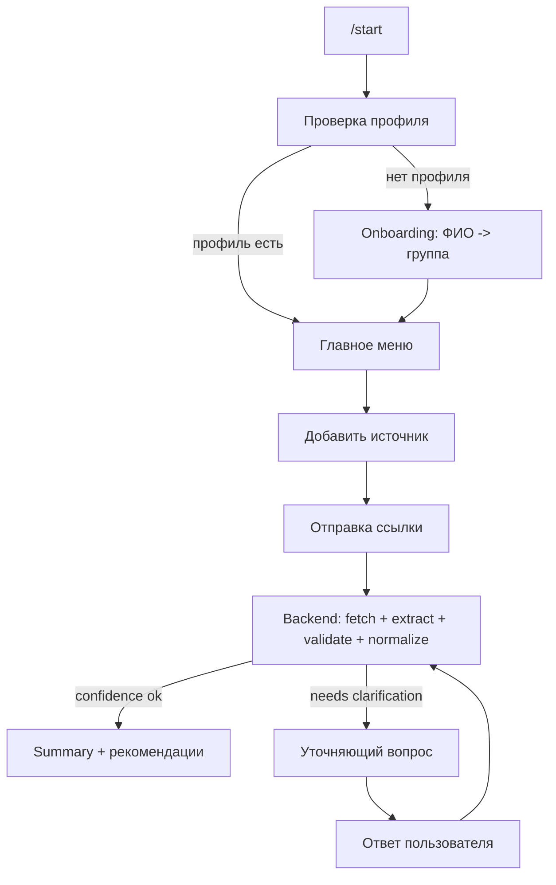

# Telegram Bot Specification

## 1. Цель документа

Этот документ описывает структуру MVP Telegram-бота для проекта `HSE Study Agent`, его сценарии работы и границы ответственности.

Документ нужен как спецификация перед реализацией:
- что именно делает бот;
- какие состояния и команды у него есть;
- как он связан с backend и текущим модулем `study_analysis`;
- какие пользовательские сценарии должны работать в MVP.

## 2. Роль Telegram-бота в системе

Telegram-бот является основным агентным интерфейсом для студента.

Бот не должен:
- сам считать оценки;
- сам парсить таблицы напрямую;
- дублировать бизнес-логику backend.

Бот должен:
- проводить onboarding;
- собирать профиль студента;
- принимать ссылки на источники;
- запускать анализ через backend;
- задавать уточняющие вопросы при низкой уверенности;
- показывать summary, дедлайны и рекомендации в удобном формате;
- вести пользователя по следующему действию.

## 3. Главный принцип

`Telegram bot = thin orchestration/client layer`

Вся основная логика остается в backend:
- загрузка источника;
- extraction;
- validation;
- normalization;
- compute / recommendation.

Для локальной разработки и быстрого MVP backend может сначала вызывать текущий `study_analysis.AnalysisPipeline`, а затем уже быть обернут в `FastAPI`.

## 4. MVP-цель бота

В MVP бот должен решать 5 задач:

1. Зарегистрировать студента и сохранить профиль.
2. Принять ссылку на публичный Google Sheets источник.
3. Запустить анализ и показать статус обработки.
4. При необходимости запросить подтверждение спорных полей.
5. Отдать краткий результат: summary, риски, дедлайны, советы.

## 5. Основные сущности, с которыми работает бот

Бот опирается на те же сущности, что уже есть в текущем анализаторе:

- `student`
  - `full_name`
  - `group`
  - позже можно добавить `course`, `program`
- `source`
  - `source_url`
  - `source_type`
  - `status`
  - `confidence`
- `subject`
  - `name`
  - `current_weighted_score`
  - `predicted_score`
  - `risk_level`
  - `confidence`
- `component`
  - `name`
  - `weight`
  - `score`
  - `max_score`
  - `status`
- `deadline`
  - `subject`
  - `name`
  - `date`
  - `urgency`
- `recommendation`
  - `subject`
  - `reason`
  - `action`
  - `urgency`

## 6. Предлагаемая структура бота

Структура должна быть совместима с `aiogram` и не смешивать Telegram UI с бизнес-логикой.

```text
project/
  app/
    bot/
      main.py
      config.py
      handlers/
        start.py
        onboarding.py
        profile.py
        sources.py
        analysis.py
        summary.py
        deadlines.py
        advice.py
        help.py
      states.py
      keyboards.py
      formatters.py
      callbacks.py
      services/
        backend_api.py
        session_service.py
      middlewares/
        logging.py
        user_context.py
```

### Назначение модулей

- `main.py` - запуск `aiogram`-бота, регистрация router-ов.
- `config.py` - токен, URL backend, feature flags.
- `handlers/start.py` - `/start`, первичный entrypoint.
- `handlers/onboarding.py` - шаги регистрации пользователя.
- `handlers/profile.py` - просмотр и редактирование профиля.
- `handlers/sources.py` - прием ссылки, список источников, повторный анализ.
- `handlers/analysis.py` - статусы анализа, ответы на уточнения.
- `handlers/summary.py` - `/summary`, карточки предметов, overview.
- `handlers/deadlines.py` - `/deadlines`.
- `handlers/advice.py` - `/advice`.
- `handlers/help.py` - `/help`.
- `states.py` - FSM-состояния диалогов.
- `keyboards.py` - reply и inline keyboard.
- `formatters.py` - форматирование результатов backend в текст Telegram.
- `callbacks.py` - callback data для inline-кнопок.
- `services/backend_api.py` - клиент backend API.
- `services/session_service.py` - краткоживущие диалоговые данные, pending clarification.
- `middlewares/` - telegram user context, логирование.

## 7. Что должно жить в backend, а не в боте

В backend должны находиться:
- создание и хранение пользователя;
- хранение источников;
- запуск анализа;
- очередь статусов `pending/running/needs_clarification/completed/failed`;
- хранение результата анализа;
- выдача summary, deadlines, recommendations;
- логика confidence и формулировка clarification payload.

Бот только:
- вызывает backend endpoint;
- показывает пользователю вопрос;
- возвращает ответ пользователя обратно в backend.

## 8. Команды бота

Минимальный набор команд для MVP:

- `/start` - приветствие, проверка профиля, старт onboarding.
- `/profile` - показать профиль и предложить изменить.
- `/add_source` - добавить новый источник.
- `/sources` - список источников и их статусов.
- `/summary` - краткая сводка по предметам.
- `/subject` - открыть карточку предмета.
- `/deadlines` - ближайшие дедлайны.
- `/advice` - персональные рекомендации.
- `/help` - список возможностей.

## 9. Кнопки и навигация

### Главное меню

После onboarding пользователь видит постоянное меню:

- `Добавить источник`
- `Сводка`
- `Дедлайны`
- `Советы`
- `Профиль`

### Inline-действия

Внутри сообщений используются inline-кнопки:

- `Запустить анализ`
- `Показать предметы`
- `Подробнее`
- `Переанализировать`
- `Подтвердить`
- `Исправить`
- `Да, это я`
- `Нет, выбрать вручную`

## 10. FSM-состояния

```text
idle
onboarding_full_name
onboarding_group
profile_edit_full_name
profile_edit_group
waiting_source_url
confirm_source
analysis_running
clarify_student_match
clarify_subject_name
clarify_grading_scheme
clarify_deadline
viewing_summary
viewing_subject_details
```

### Краткая логика состояний

- `idle` - пользователь не находится внутри обязательного сценария.
- `onboarding_full_name` - ожидается ФИО.
- `onboarding_group` - ожидается группа.
- `waiting_source_url` - ожидается ссылка или файл.
- `confirm_source` - пользователь подтверждает, что источник корректный.
- `analysis_running` - бот показывает статус и не просит новый ввод, кроме команд.
- `clarify_*` - backend вернул вопрос с низкой уверенностью.
- `viewing_*` - необязательные UI-состояния для навигации.

## 11. Базовый пользовательский поток



## 12. Сценарии работы бота

### Сценарий 1. Первый запуск и onboarding

Цель:
собрать минимальный профиль пользователя.

Шаги:
1. Пользователь нажимает `/start`.
2. Бот приветствует и кратко объясняет ценность.
3. Если профиля нет, бот просит ввести ФИО.
4. После ФИО бот просит группу.
5. Бот сохраняет профиль.
6. Бот предлагает сразу добавить первый источник.

Сообщение после успеха:
`Профиль сохранен. Теперь пришли публичную ссылку на Google Sheets с ведомостью, и я соберу сводку по предмету.`

### Сценарий 2. Добавление источника

Цель:
получить ссылку на источник для анализа.

Шаги:
1. Пользователь нажимает `Добавить источник` или `/add_source`.
2. Бот объясняет допустимые форматы.
3. Пользователь отправляет ссылку.
4. Бот валидирует, что это похоже на публичный `Google Sheets`.
5. Бот показывает краткое подтверждение:
   - ссылка принята;
   - тип источника распознан;
   - анализ можно запускать.
6. Пользователь нажимает `Запустить анализ`.

Если ссылка невалидна:
- бот не падает;
- бот объясняет, что именно ожидается;
- остается в `waiting_source_url`.

### Сценарий 3. Анализ без уточнений

Цель:
показать быстрый успешный результат.

Шаги:
1. Бот создает запись источника в backend.
2. Бот запускает анализ.
3. Показывает промежуточный статус:
   - `Источник получен`
   - `Извлекаю структуру`
   - `Проверяю данные`
   - `Считаю рекомендации`
4. Backend возвращает `completed`.
5. Бот отправляет:
   - короткую сводку по предмету;
   - риск-статус;
   - ближайшие дедлайны;
   - 1-3 ключевых рекомендации.
6. Бот предлагает действия:
   - `Сводка`
   - `Дедлайны`
   - `Советы`
   - `Добавить еще источник`

### Сценарий 4. Низкая уверенность, нужен student match

Цель:
разрешить ситуацию, когда student row найден неуверенно.

Когда срабатывает:
- `matched_student.confidence` ниже порога;
- backend не уверен, что нашел правильную строку.

Поведение:
1. Backend возвращает `needs_clarification`.
2. Бот показывает вопрос:
   `Я не до конца уверен, что нашел твою строку. Похоже на: Иванов И.И. Продолжить?`
3. Кнопки:
   - `Да, это я`
   - `Нет`
4. Если `Да`, бот отправляет подтверждение в backend.
5. Если `Нет`, бот просит ввести вариант имени вручную или выбрать из кандидатов.

### Сценарий 5. Низкая уверенность в формуле оценивания

Цель:
получить подтверждение по grading scheme.

Когда срабатывает:
- `grading_scheme.confidence` ниже порога;
- не все веса понятны;
- формула выглядит неоднозначной.

Поведение:
1. Бот пишет:
   `Я неуверенно распознал формулу оценивания. Сейчас вижу так: 0.4*ДЗ + 0.2*КР + 0.4*экзамен`
2. Кнопки:
   - `Подтвердить`
   - `Исправить`
3. Если `Подтвердить`, анализ продолжается.
4. Если `Исправить`, бот просит отправить формулу в простом текстовом виде.
5. Исправление отправляется в backend как clarification payload.

### Сценарий 6. Низкая уверенность в дедлайне

Цель:
не показывать выдуманные даты как факт.

Когда срабатывает:
- дедлайн найден, но `confidence` низкий;
- дата выглядит неоднозначно.

Поведение:
1. Бот пишет:
   `Нашел возможный дедлайн по предмету "Алгоритмы": Экзамен 2026-03-21. Подтвердить?`
2. Кнопки:
   - `Подтвердить`
   - `Нет даты`
   - `Исправить`
3. После ответа бот обновляет backend-данные и финализирует анализ.

### Сценарий 7. Просмотр summary

Цель:
дать быстрый обзор текущей учебной ситуации.

Что показывает бот:
- количество предметов;
- средний прогнозируемый балл;
- количество high-risk предметов;
- количество источников с неполными данными.

По каждому предмету:
- название;
- `predicted_score`;
- `risk_level`;
- confidence-индикатор, если он низкий.

Кнопки:
- `Подробнее`
- `Дедлайны`
- `Советы`

### Сценарий 8. Просмотр карточки предмета

Цель:
показать человеку объяснимую детализацию.

Что показывает бот:
- название предмета;
- текущий weighted score;
- predicted score;
- risk level;
- список компонент:
  - название;
  - вес;
  - score/max_score;
  - статус `complete/pending`.

Отдельно:
- предупреждения по качеству данных;
- ссылка на источник;
- рекомендации по этому предмету.

### Сценарий 9. Просмотр дедлайнов

Цель:
дать короткий actionable список.

Логика:
- сортировка по дате;
- сначала `urgency=high`;
- затем `medium`;
- затем `low`.

Формат:
- `Алгоритмы — Экзамен — 2026-03-21 — высокий приоритет`

Если дедлайнов нет:
- бот честно пишет, что не смог надежно извлечь даты.

### Сценарий 10. Просмотр рекомендаций

Цель:
дать не просто цифры, а следующие действия.

Бот показывает:
- 1-3 глобальных рекомендации;
- затем рекомендации по high-risk предметам.

Пример формата:
- причина;
- что сделать;
- срочность.

### Сценарий 11. Повторный анализ источника

Цель:
обновить данные после исправления таблицы или ручного уточнения.

Шаги:
1. Пользователь открывает `/sources`.
2. Видит список ранее добавленных ссылок.
3. Выбирает источник.
4. Нажимает `Переанализировать`.
5. Backend перезапускает pipeline.

### Сценарий 12. Ошибка загрузки источника

Цель:
обработать неуспешный fetch без потери доверия.

Причины:
- ссылка недоступна;
- Google Sheet не публичный;
- источник пустой.

Ответ бота:
- что пошло не так;
- что проверить;
- как исправить.

Пример:
`Не удалось загрузить таблицу. Похоже, доступ к Google Sheets закрыт. Проверь, что файл открыт по ссылке для чтения.`

## 13. Правила UX для бота

### Бот должен

- отвечать коротко и по делу;
- явно говорить, что подтверждено, а что предположено;
- не скрывать низкую уверенность;
- не выдавать сомнительные данные как точные;
- всегда предлагать следующее действие.

### Бот не должен

- отправлять слишком длинные полотна текста;
- перегружать пользователя сырой JSON-структурой;
- показывать внутренние технические ошибки без перевода на человеческий язык;
- делать вид, что все понял, если confidence низкий.

## 14. Статусы анализа

У каждого источника должен быть lifecycle status:

- `created` - источник сохранен, анализ еще не начат.
- `queued` - задача готова к запуску.
- `running` - pipeline выполняется.
- `needs_clarification` - требуется ответ пользователя.
- `completed` - анализ завершен.
- `failed` - анализ завершился ошибкой.

Дополнительно useful поля:
- `progress_message`
- `overall_confidence`
- `last_error`
- `updated_at`

## 15. Ожидаемые backend endpoint-ы для бота

Это не финальный контракт, а рекомендуемый MVP API.

- `POST /users/telegram/{telegram_id}/register`
  - создать или обновить профиль
- `GET /users/telegram/{telegram_id}`
  - получить профиль
- `POST /sources`
  - сохранить источник
- `GET /sources?telegram_id=...`
  - получить список источников
- `POST /sources/{source_id}/analyze`
  - запустить анализ
- `GET /sources/{source_id}/status`
  - получить статус
- `POST /sources/{source_id}/clarifications`
  - отправить ответ на уточнение
- `GET /users/telegram/{telegram_id}/summary`
  - получить summary по всем завершенным анализам
- `GET /users/telegram/{telegram_id}/deadlines`
  - получить дедлайны
- `GET /users/telegram/{telegram_id}/recommendations`
  - получить рекомендации
- `GET /subjects/{subject_id}`
  - получить детальную карточку предмета

## 16. Режим без backend на первом этапе

Да, бота можно сделать вообще без отдельного backend сервиса.

Это нормальный путь для MVP, если сразу заложить правильные границы модулей.

### Как это должно выглядеть

Бот запускается как единое приложение и внутри себя использует локальные сервисы:

- `ProfileRepository`
- `SourceRepository`
- `AnalysisService`
- `ClarificationService`
- `ResultQueryService`

Сначала эти сервисы работают локально:
- напрямую вызывают `study_analysis.AnalysisPipeline`;
- хранят профиль и результаты в простом локальном `SQLite`;
- возвращают боту уже готовые Python-объекты.

Позже backend подключается без переписывания handler-ов:
- handler-ы продолжают вызывать те же сервисные интерфейсы;
- меняется только реализация слоя `services/`;
- вместо локального вызова pipeline сервис начинает дергать HTTP API.

### Главное правило

Нельзя делать так, чтобы `handlers/*.py` напрямую:
- читали SQLite;
- вызывали `AnalysisPipeline`;
- сами собирали бизнес-логику анализа.

Если это правило соблюдено, переход на backend будет быстрым.

### Рекомендуемая схема адаптеров

```text
handlers -> bot service interfaces -> implementation

Вариант 1 (сейчас):
handlers -> LocalAnalysisService -> AnalysisPipeline + SQLite

Вариант 2 (потом):
handlers -> RemoteAnalysisService -> FastAPI backend
```

### Что это дает

- можно очень быстро показать рабочего бота для демо;
- не нужно ждать backend;
- потом не придется переписывать все хендлеры;
- замена произойдет на уровне адаптера, а не всей архитектуры.

## 17. Как текущий `study_analysis` встраивается в эту схему

На текущем этапе уже существует ядро анализа:

- загрузка источника: `study_analysis.fetchers`
- preprocess: `study_analysis.preprocess`
- extraction: `study_analysis.extractor`
- optional LLM help: `study_analysis.llm`
- validation: `study_analysis.validator`
- normalization: `study_analysis.normalizer`
- orchestration: `study_analysis.pipeline.AnalysisPipeline`

Значит, первый MVP можно сделать вообще без backend-сервиса:

1. бот получает `source`, `full_name`, `group`;
2. локальный сервис вызывает `AnalysisPipeline.analyze(...)`;
3. результат сохраняется в локальном `SQLite`;
4. при низком confidence локальный сервис возвращает clarification;
5. бот показывает вопрос и принимает ответ.

Когда появится backend, он может стать thin wrapper над тем же `AnalysisPipeline`:

1. backend получает `source`, `full_name`, `group`;
2. вызывает `AnalysisPipeline.analyze(...)`;
3. сохраняет `normalized` результат;
4. при низком confidence возвращает clarification;
5. бот показывает вопрос и отправляет ответ обратно.

## 18. Минимальные formatter-ы ответов бота

### Summary formatter

Должен уметь собрать короткий ответ вида:

```text
Сводка по учебе:
- Средний прогноз: 6.8
- Предметов с высоким риском: 2
- Неполных источников: 1

Алгоритмы: прогноз 5.9, риск высокий
Линал: прогноз 7.4, риск средний
```

### Subject details formatter

Должен уметь показать:

```text
Алгоритмы
Текущий балл: 3.8
Прогноз: 6.6
Риск: высокий

Компоненты:
- ДЗ: 7/10, вес 0.4
- КР: 5/10, вес 0.2
- Экзамен: pending, вес 0.4
```

### Clarification formatter

Должен всегда содержать:
- что именно найдено неуверенно;
- текущую гипотезу;
- что пользователь должен сделать дальше.

## 19. Нефункциональные требования

- бот должен переживать повторный `/start`;
- любое состояние должно иметь способ вернуться в `idle`;
- при падении backend пользователь получает понятное сообщение;
- сообщения должны быть пригодны для демонстрации на хакатоне;
- сценарий должен работать без frontend, только через Telegram.

## 20. Что не входит в первый MVP

- полноценная поддержка любых закрытых сайтов;
- сложная многопользовательская аналитика;
- групповые чаты;
- загрузка десятков источников в фоне с очередями;
- сложный ML ranking рекомендаций;
- свободный чат с ботом на любые темы.

## 21. Зафиксированные решения по MVP

Для текущего этапа считаем принятыми такие решения:

1. Один Telegram user = один профиль студента.
2. Один источник = один анализируемый документ по одному предмету.
3. Основной источник в MVP - публичный `Google Sheets`.
4. Все вычисления и confidence живут в сервисном слое анализа, а не в Telegram handler-ах.
5. Бот задает только структурированные уточняющие вопросы.
6. После каждого завершенного анализа бот всегда предлагает следующий CTA.
7. Команда `/subject` входит в MVP.
8. Формулу оценивания бот вручную не собирает: это зона backend и внешнего источника данных.
9. Первый этап делаем как быстрый бот поверх локального pipeline, без отдельного backend сервиса.

## 22. Что стоит проверить перед началом кодинга

Ниже список точек для твоего подтверждения:

1. Нужны ли в onboarding еще `course` и `program`, или пока оставляем только `full_name + group`.
2. Храним ли результат только последнего анализа по источнику, или еще и историю перезапусков.
3. Нужна ли кнопка `Удалить источник` уже в MVP.
